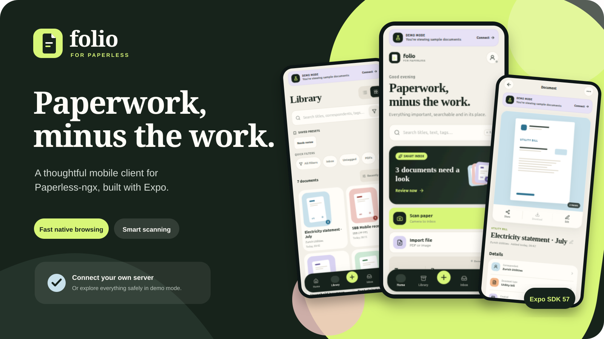
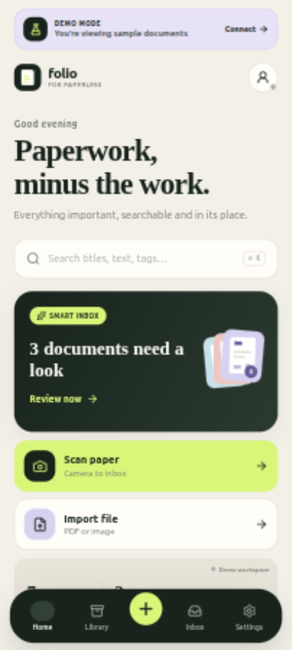
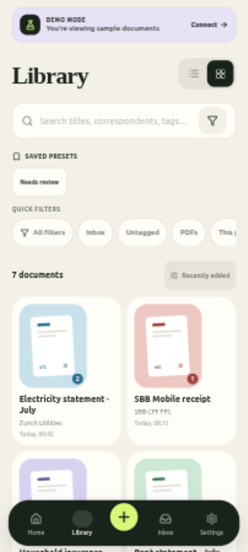
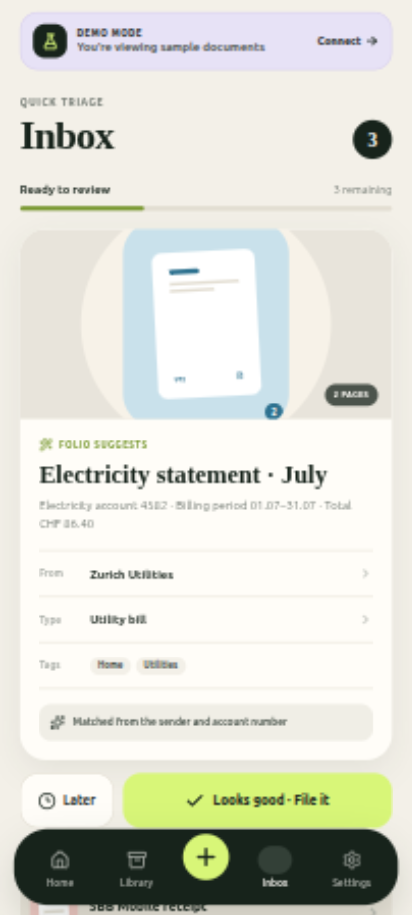
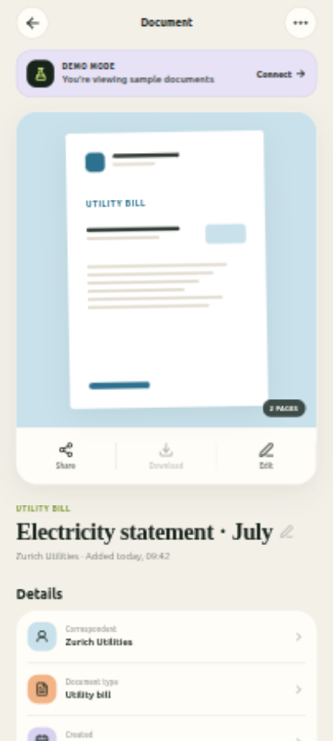

# Folio for Paperless

<p align="center">
  
</p>

<p align="center">
  <a href="https://github.com/Kirari04/folio-paperless/actions/workflows/ci.yml"></a>
  <a href="https://github.com/Kirari04/folio-paperless/releases/latest"></a>
</p>

Folio is a clean, mobile-first client for [Paperless-ngx](https://docs.paperless-ngx.com/).
It is built with Expo SDK 57 and React Native. Folio is an independent community project and is
not affiliated with or endorsed by the Paperless-ngx project.

> [!IMPORTANT]
> Folio is under active development. Keep reliable backups of your Paperless data and review
> destructive actions carefully.

## What is included

- A focused home dashboard with global search, inbox status, and recent documents.
- A searchable, filterable document library with list and grid views.
- A guided inbox triage flow that removes the Paperless `inbox` tag when filed.
- Native camera scanning and PDF/image import, with upload task polling and failure states.
- Authenticated thumbnails, full OCR text, title/date/correspondent/type/tag editing, and tag creation.
- Saved views, storage paths, archive serial numbers, and every Paperless custom-field type.
- Per-document notes and full version history, including replacement uploads, labels, previews, and export.
- Recoverable deletion with a dedicated Paperless trash screen for restore and permanent erase.
- Native file sharing/export plus document reprocessing and guarded deletion.
- Optional biometric locking and local notifications when an upload finishes processing.
- GitHub-only Android update checks with signed APK verification, download progress, and a system-installer handoff.
- Reduce-Motion-aware page transitions, tactile press feedback, semantic haptics, and animated state changes.
- Direct Paperless-ngx API v10 connectivity with credentials stored in Secure Store.
- A polished demo workspace so the product can be evaluated without a server.

## Inside Folio

<p align="center">
  
  
  
  
</p>

<p align="center">
  <sub>Dashboard · Grid library · Quick triage · Document details</sub>
</p>

## Requirements

- Node.js and npm
- Android Studio for Android development, or Xcode for iOS development
- A Paperless-ngx server and API token for live data (optional; Folio includes a demo mode)

Folio uses native modules for document scanning and PDF viewing, so it requires an Expo
development build. It does not run completely in Expo Go.

## Android releases

Signed Android APKs are available from [GitHub Releases](https://github.com/Kirari04/folio-paperless/releases).
GitHub release builds are Android-only for now; there is no iOS, Play Store, or App Store package
yet. Every release includes a SHA-256 checksum alongside the universal APK.

Signed release builds check GitHub Releases once per day and also provide a manual check in
**Settings → Software updates**. Folio never installs silently: it downloads only after confirmation,
verifies the SHA-256 digest, package ID, version, and official signing certificate, then hands the
APK to Android's system installer for final approval. The first updater-enabled release must be
installed manually; later signed releases can update from inside Folio.

Development builds and GitHub release APKs use different signing identities. Android will not
install one as an update over the other, so the in-app updater is intentionally disabled in
development builds. Keep the development build if it contains Paperless credentials, and test a
release on a clean emulator or spare device.

## Run on Android

```bash
npm install
npx expo run:android
npx expo start --dev-client
```

The first command builds and installs the native app. After that, start Metro with the second
command and open the installed development build. A physical device is recommended for scanning.

## Run on iOS

On macOS with Xcode installed:

```bash
npm install
npx expo run:ios
npx expo start --dev-client
```

Processing notifications are local. Remote push notifications are intentionally not configured.
The first GitHub-distributed iOS build is iPhone-only and requires an HTTPS Paperless address with
a certificate trusted by the device. See the [iOS release-readiness checklist](docs/ios-release-readiness.md)
for the physical-device gate that precedes release automation.

## Connect Paperless

Open **Settings**, enter the base URL of your Paperless-ngx instance and an API token, then
tap **Test & connect**. Folio sends `Accept: application/json; version=10` and
`Authorization: Token …` with requests.

Paperless tokens are available from **My Profile** in the Paperless web app. On native platforms
the token is stored with `expo-secure-store`; web builds use browser-local storage and are intended
for development/demo use.

Folio never writes a server address or token into the source tree. Do not commit personal `.env`
files, signing keys, or exported Paperless data when contributing.

## Useful checks

```bash
npm run typecheck
npm run lint
npm test
npx expo-doctor
npx expo export --platform web
```

## Development workflow

The persistent branches are protected. Create feature and fix branches from `dev`, open a pull
request back to `dev`, and squash merge after `CI / Required checks` passes. Promotions from
`dev` to `main` use merge commits so Release Please can calculate the next semantic version from
the individual Conventional Commits.

Release Please opens the version/changelog pull request on `main`. Merging that pull request
builds, verifies, and publishes a signed Android APK. See [CONTRIBUTING.md](CONTRIBUTING.md) for
branch naming, accepted PR titles, merge methods, and release recovery.

## License

[MIT](LICENSE)
